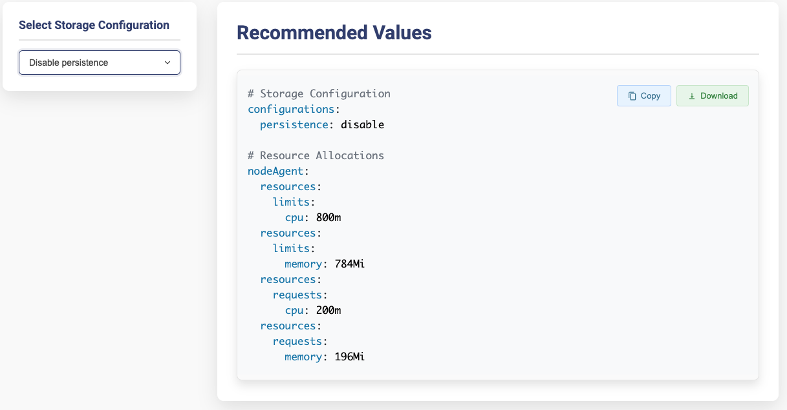

# Kubescape Prerequisites Checker

## Overview

Kubescape Prerequisites Checker analyzes your Kubernetes cluster and generates recommended Helm values to ensure Kubescape runs smoothly and efficiently.

## Prerequisites

- **Kubeconfig** configured for access to the Kubernetes cluster where you plan to deploy Armo (either via default `~/.kube/config` or a custom path passed to `--kubeconfig`).

## Run the Check

There are two ways to run the check:

### Option 1 - Local Run

1. **Clone and navigate to the repository**:
   ```sh
   git clone https://github.com/kubescape/sizing-checker.git
   cd sizing-checker/
   ```
2. **Run the program** (using default `~/.kube/config` if no in-cluster config is found):
   ```sh
   go run ./cmd/checker
   ```
   - **Optional**: If you want to point to a **custom** kubeconfig, use:
     ```sh
     go run ./cmd/checker --kubeconfig /path/to/another-kubeconfig
     ```

### Option 2 - In-cluster Run

#### Prerequisites

- **Permissions** to create ServiceAccounts, ClusterRoles, ClusterRoleBindings, and Jobs.

1. **Deploy the Kubernetes manifest:**

   Apply the Kubernetes manifest to set up the necessary resources:

   ```sh
   kubectl apply -f k8s-manifest.yaml
   ```

2. **Verify Job Completion:**

   Check the status and logs of the Job:

   ```sh
   kubectl wait -n kubescape-prerequisite --for=condition=complete job/kubescape-prerequisite --timeout=60s
   kubectl logs -n kubescape-prerequisite job/kubescape-prerequisite
   ```

3. **Export the Files:**

   Retrieve the `recommended-values.yaml` and `prerequisites-report.html` from the ConfigMap:

   ```sh
   kubectl get -n kubescape-prerequisite configmap kubescape-prerequisites-report -n default -o go-template='{{ index .data "recommended-values.yaml" }}' > recommended-values.yaml
   kubectl get -n kubescape-prerequisite configmap kubescape-prerequisites-report -n default -o go-template='{{ index .data "prerequisites-report.html" }}' > prerequisites-report.html
   ```

4. **Clean Up Resources:**

   After extracting the necessary files, remove the deployed resources to free up cluster space:
   ```sh
   kubectl delete -f k8s-manifest.yaml
   ```

## Usage

### Deploy Kubescape with Recommended Resources

Use Helm to deploy Kubescape using the recommended values:

```sh
helm upgrade --install kubescape kubescape/kubescape-operator \
  --namespace kubescape --create-namespace \
  --values recommended-values.yaml [other parameters]
```

### View the Prerequisites Report

If you want to review the prerequisites report, open the HTML file:

**Open in Browser:**

- **macOS:**
    ```sh
    open prerequisites-report.html
    ```
- **Linux:**
    ```sh
    xdg-open prerequisites-report.html
    ```
- **Windows (Git Bash):**
    ```sh
    start prerequisites-report.html
    ```

## Output

### Local Run
```plaintext
------------------------------------------------------------
✅ Prerequisites report generated locally!
• /tmp/prerequisites-report.html (HTML report)
• /tmp/recommended-values.yaml (Helm values file)

📋 Open /tmp/prerequisites-report.html in your browser for details.
🚀 Use the generated recommended-values.yaml to optimize Kubescape for your cluster.
------------------------------------------------------------
```

### In-cluster Run
```sh
kubectl logs job/kubescape-prerequisite
```
```plaintext
------------------------------------------------------------
✅ Prerequisites report stored in Kubernetes ConfigMap!
• ConfigMap Name: prerequisites-report
• Namespace: default
------------------------------------------------------------

⬇️ To export the report and recommended values to local files, run the following commands:
    kubectl get configmap kubescape-prerequisites-report -n default -o go-template='{{ index .data "prerequisites-report.html" }}' > prerequisites-report.html
    kubectl get configmap kubescape-prerequisites-report -n default -o go-template='{{ index .data "recommended-values.yaml" }}' > recommended-values.yaml
    kubectl get configmap kubescape-prerequisites-report -n default -o go-template='{{ index .data "review-values.html" }}' > review-values.html

📋 Open prerequisites-report.html in your browser for details.
🚀 Use the generated recommended-values.yaml to optimize Kubescape for your cluster.
------------------------------------------------------------
```

## Report example

### Main Report


### In-cluster Command


### Adjustments Details


### Recommended Values

